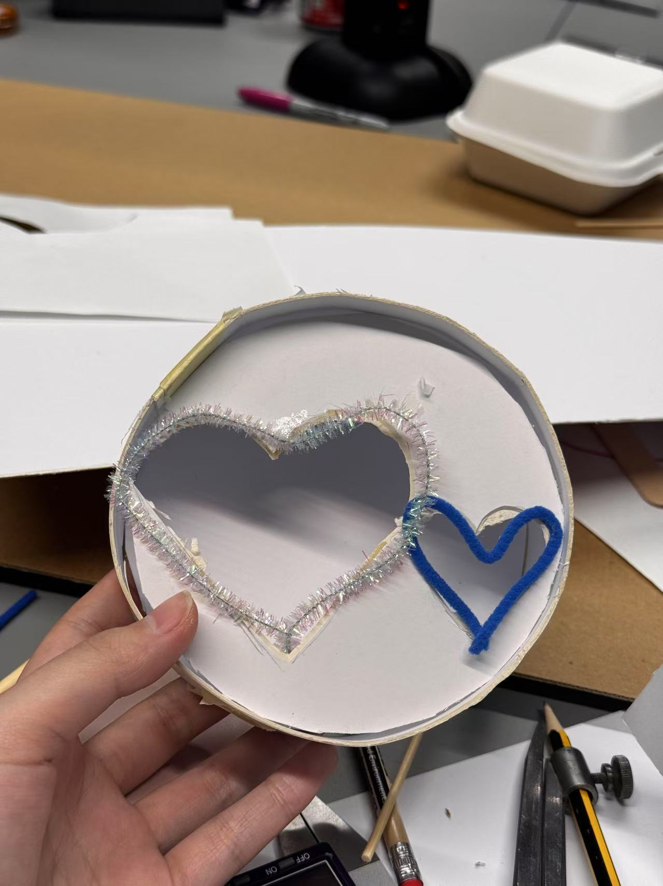
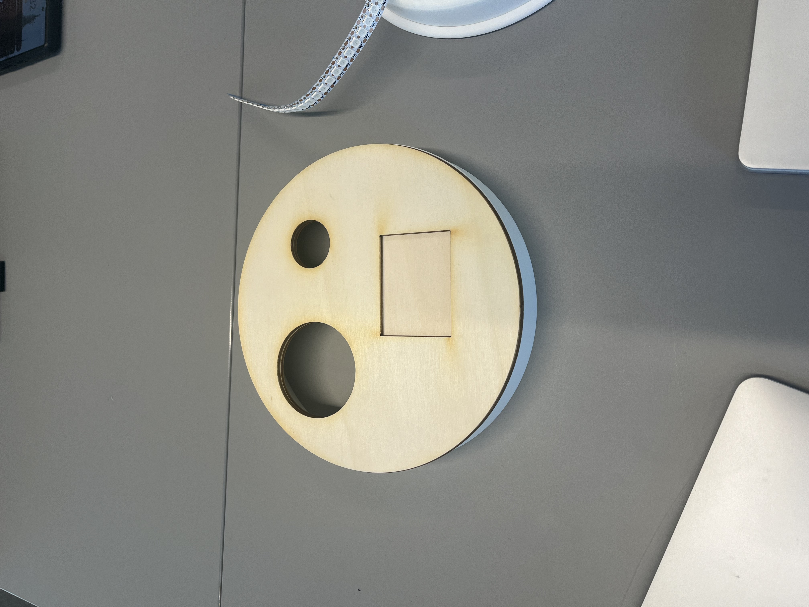
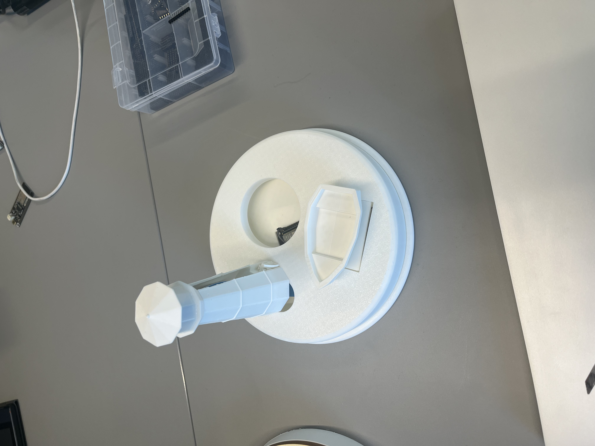
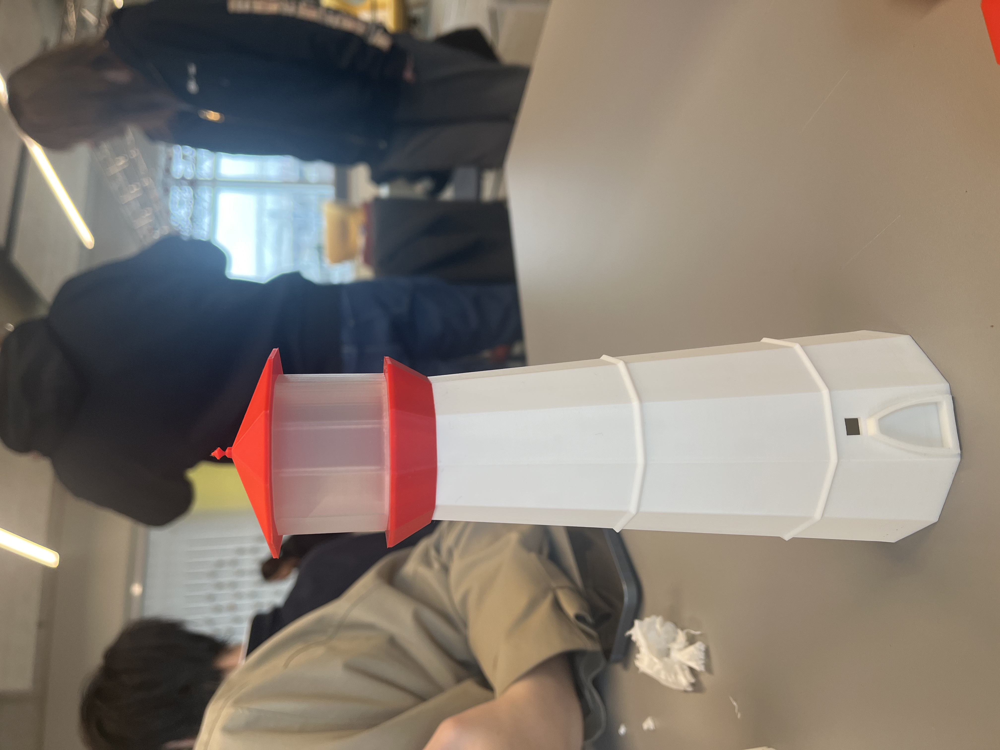
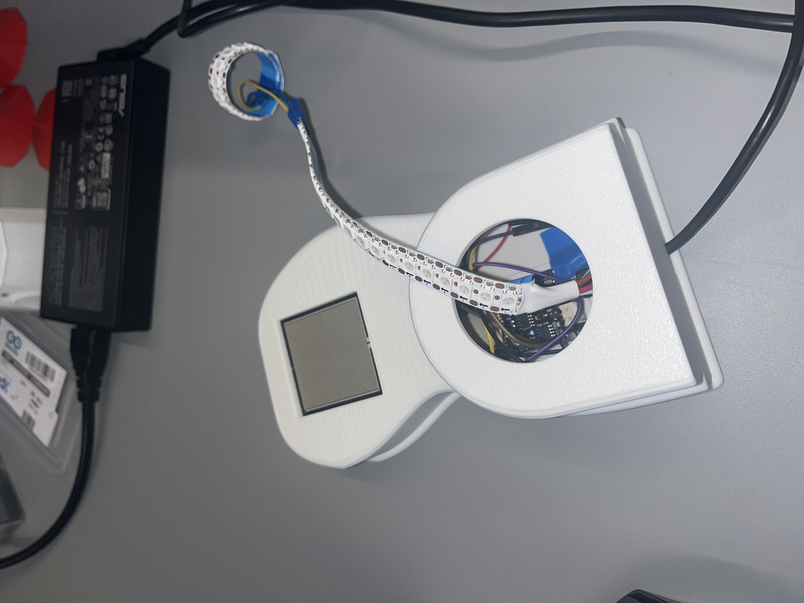

# Group 5 - Guding Glow

"Lighthouses guide ships while ours guides peace of mind. When your child gets home, the lighthouse lights up on your end, no texts needed. A reassuring ambient glow to say, ‘I’m home and safe’ no matter the distance."

## Why a Lighthouse?
The concept of a lighthouse inspired us as lighthouses observe ships out at sea and guide them at their lights. This can also be applied to a parent-child relationship especially where a parent does not want to be intrusive and respects their child's independence while still being present to guide and reassure them.

## Background 
As globalisation grows, more young people move abroad to study and work. However, this comes with  challenges. For example, while abroad keeping in touch with family consistently can be a bit of a challenge for international students. This could potentially lead to parents feeling anxious due to the lack of consistent updates. Moreover, parents may also not want to intrude on their child's independence whilst letting their child know they are always around to help. Therefore, our device aims to address this issue by allowing parents to receive ambient updates from their children reassuring them. At the same time, reminding the child that their parents are always there ready to guide and support them.

### Target Demographic
We have decided to primarily market this device to international students and their parents.

International students – Studying abroad, living independently for the first time, and looking for a way to stay connected with their families without constant messaging.

Parents of international students – Wanting reassurance about their child’s safety while respecting their independence. Many may experience empty nest syndrome and seek non-intrusive ways to stay connected.

Primary Target: Parents of international students, especially in cultures that value family connection. They worry about their child's safety, but want a non-intrusive way to stay connected—and they’re the ones making the purchase.

## Initial Prototyping 

Here's an example of an initial rapid prototype of the shape of our device. This was before our lighthouse idea.

We also tried experimenting with a wooden base, to give it a warm, home-like feeling.

This was after our lighthouse idea had been finalised, however, the boat was too small and it lacked colour.

We decided to keep the colours on the lighthouse minimalistic

## Circuit
The circuit is quite simple and only has an ESP32, LED strip and the RP-S40-ST Pressure Sensor. When a key is placed on the pressure sensor, this information is sent to the other ESP over wifi via MQTT. This then lights the parent's device informing them their child is home. 

| Component   | Purpose                                   |
| ----------- | -----------                               |
| ESP32       | Cheap wireless communication              |
| Pressure Sensor | Trigger to notify parent's device     |
| LEDs        |Visual status updates                      |

Below is a picture of the circuit in action inside our device:

In addition here is the circuit diagram for our device.

## Video

### Schedule 

