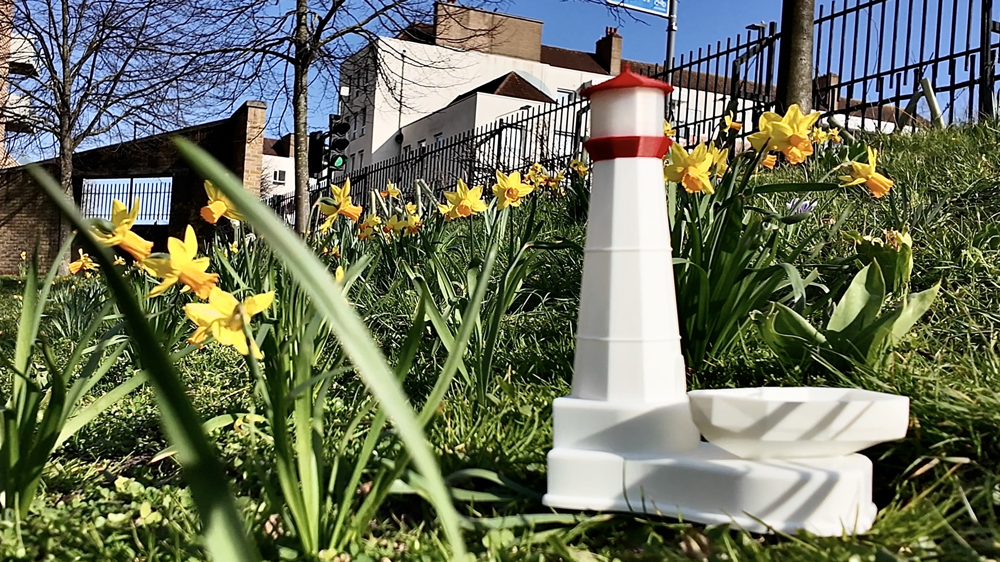
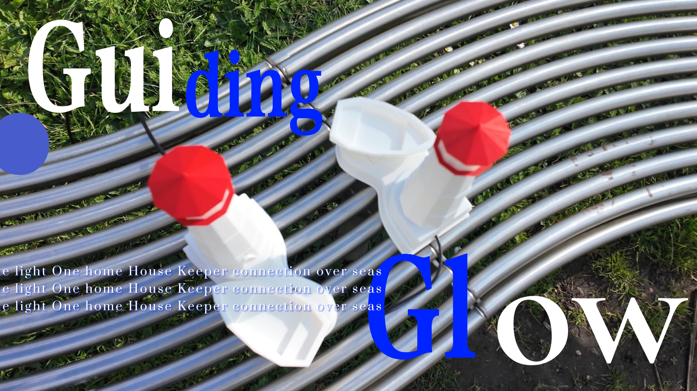

# 👥 Team 
- Zhiyu Cao - Hardware Design
- Muchen Han - Software Design
- Zinan Ye - Creative and Media Marketing
- Emmanuel Gyamfi - Overall Design

For any questions regarding Guiding Glow, feel free to contact the team at the email addresses below:
ucfneeg@ucl.ac.uk
zinan.ye.24@ucl.ac.uk

# 🚢🌟 Group 5 - Guiding Glow 

> _"Lighthouses guide ships while ours guides peace of mind. When your child gets home, the lighthouse lights up on your end—no texts needed. A reassuring ambient glow that says, ‘I’m home and safe,’ no matter the distance."_

---

## 🌊 Why a Lighthouse?

🌟 Lighthouses have long symbolised guidance, safety, and reassurance. Inspired by their symbolic power, we've designed **Guiding Glow** to nurture the connection between parents and their children studying abroad. Just as a lighthouse guides ships safely home, our device offers parents subtle reassurance that their children are safe and sound, without intrusion.

---
## 📖 Background

With the rise of globalisation, more young individuals pursue education abroad. This enriching experience can, however, lead to increased anxiety for parents due to infrequent communication.

✨ **Guiding Glow** provides:
- **Ambient updates**: Non-intrusive status indicators
- **Emotional reassurance**: A constant yet gentle reminder of familial bonds
- **Respect for independence**: Reduces anxiety without compromising privacy

---

## 🎯 Target Demographic

🌍 **International Students**
- Experiencing independent living abroad for the first time
- Seeking connection without constant digital interactions

👨‍👩‍👧 **Parents of International Students**
- Wanting non-intrusive reassurance of their child's safety
- Dealing with empty nest syndrome
- Valuing continuous family connection, especially across cultures

**🔑 Primary Users**: Parents, particularly those from family-oriented cultures, who appreciate discreet yet meaningful updates about their children's well-being.

---

## 🎨 Prototyping Journey

🚀 **Early Prototype**

Our initial rapid prototype explored various shapes before settling on the lighthouse concept.

🏠 **Wooden Base Experiment**

To evoke warmth and familiarity, we experimented with a wooden base.

⛵ **Refining the Lighthouse**

Initial designs included a small boat but lacked vibrancy:

🎯 **Minimalistic Lighthouse**

We finalised a sleek, minimalistic look to fit modern aesthetics:

---

## 🔌 How It Works (Circuit)

The circuit behind **Guiding Glow** is simple, efficient, and elegant:

- **🔹 ESP32**: Wireless communication via MQTT
- **🟢 Pressure Sensor (RP-S40-ST)**: Detects key placement signaling "I'm home"
- **💡 LED Strip**: Provides visual feedback, lighting up the parent's lighthouse

📸 **Inside Look:**

📝 **Circuit Diagram:**

---

## 🎬 Project Video

📺 [**Watch on YouTube**](https://youtu.be/-N3DUTWYL2w)

---

### 🌟 Stay connected, stay reassured—Guiding Glow makes distance feel a little shorter.
